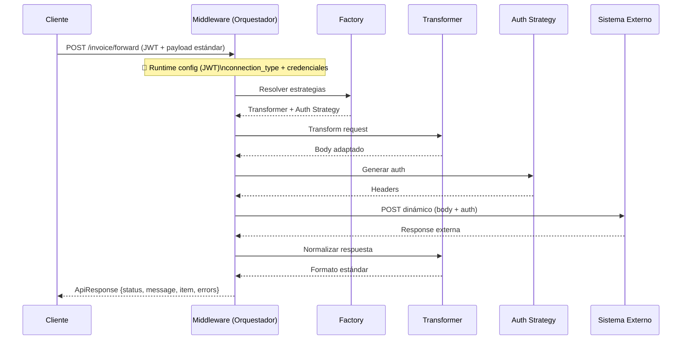

# Finnecto Middleware (Entrega)

Este es un middleware desacoplado que unifica múltiples integraciones de facturación bajo un mismo contrato estándar, resolviendo dinámicamente la transformación y la autenticación mediante patrones Factory y Strategy basados en una configuración en runtime (JWT).

## TL;DR
 - Un solo endpoint ("/invoice/forward")
 - Soporta múltiples sistemas como lo son legacy y taxeable
 - Comportamiento dinámico basado en JWT
 - Arquitectura desacoplada y extensible
 - Respuesta estandarizada

## Arquitectura en una sola frase

Orquestador basado en pipeline dinámico, donde cada request determina su comportamiento (transformación, autenticación y destino) en runtime a partir de lo que llega en los claims de JWT.

## Requisitos

- Python \(>= 3.14\)
- [Poetry]
- (Opcional) Docker + Docker Compose para levantar el mock

## Variables de entorno

Este servicio soporta `.env` (ver `.env.example`).

- **`MOCK_SERVER_URL`**: base URL del mock. Default: `http://localhost:3000`
- **`JWT_DECODE_SECRET`**: secret para validar/decodificar el JWT entrante. Default: `incoming-jwt-dev-secret`

## Cómo ejecutar

### Levantar el mock server

Con Docker:

```bash
cd ../mock-server
docker-compose up --build
```

Verificar:

```bash
curl http://localhost:3000/health
```

### Levantar el middleware

```bash
poetry install
poetry run uvicorn main:app --reload
```

Verificar:

```bash
curl http://localhost:8000/health
```

## Happy path (flujo completo)

### 1) Preparar JWT de entrada

El request entrante exige `Authorization: Bearer <token>`.

- **Legacy**: JWT con claims `connection_type=legacy`, `username`, `password`.
- **Taxeable**: además incluye `secret` (usado para generar el JWT de salida al mock).

En el `README.md` del challenge hay tokens de ejemplo ya firmados con `incoming-jwt-dev-secret`. Aunque estos ya no sirven para probar en un inicio porque están vencidos.

### 2) Enviar factura estándar al middleware

Body estándar (ejemplo):

```json
{
  "number": "FNCT0006",
  "reception_date": "2026-03-03",
  "due_date": "2026-03-20",
  "currency": "COP",
  "total": 780000,
  "items": [
    {
      "description": "Item 1",
      "unit_price": 30000,
      "total": 390000,
      "account": "VISTA"
    }
  ]
}
```

#### Caso legacy

```bash
curl -sS -X POST http://localhost:8000/invoice/forward \
  -H "Content-Type: application/json" \
  -H "Authorization: Bearer <JWT_LEGACY>" \
  -d '{"number":"FNCT0006","reception_date":"2026-03-03","due_date":"2026-03-20","currency":"COP","total":780000,"items":[{"description":"Item 1","unit_price":30000,"total":390000,"account":"VISTA"}]}'
```

El middleware:

- Decodifica el JWT entrante
- Aplica IVA 19% a cada línea (solo sobre `total` de ítem) y recalcula total de cabecera
- Transforma el body a formato legacy
- Autentica contra el mock usando **Basic Auth** con `username/password` del JWT
- Envía a `POST ${MOCK_SERVER_URL}/legacy`
- Toma la respuesta y la transforma al formato estándar

#### Caso taxeable

```bash
curl -sS -X POST http://localhost:8000/invoice/forward \
  -H "Content-Type: application/json" \
  -H "Authorization: Bearer <JWT_TAXEABLE>" \
  -d '{"number":"FNCT0006","reception_date":"2026-03-03","due_date":"2026-03-20","currency":"COP","total":780000,"items":[{"description":"Item 1","unit_price":30000,"total":390000,"account":"VISTA"}]}'
```

El middleware:

- Decodifica el JWT entrante y extrae `secret`
- Transforma el body a formato taxeable
- Genera un JWT de salida con:
  - `iss="middleware-mock"`
  - `aud="taxeable-api"`
  - `exp` a 1 hora
- Envía a `POST ${MOCK_SERVER_URL}/taxeable` con `Authorization: Bearer <token-generado>`
- Toma la respuesta y la transforma al formato estándar

## Flujo Principal

### Pasos comunes
- Se recibe request con `Authorization: Bearer <token>` + payload estándar
- Se decodifica el JWT y se extraen claims: `connection_type`, `username`, `password` (y `secret` si aplica)
- Se resuelve dinámicamente el comportamiento con `ConnectionFactory`:
  - Transformer (legacy/taxeable)
  - AuthStrategy (Basic/JWT)
- Se construye la entity `Invoice` desde el DTO
- (Solo `legacy`) se aplica IVA (19%) por línea y se recalcula el total
- Se transforma el body al formato del sistema destino (legacy/taxeable)
- Se construye el `Authorization` del sistema destino (Basic o JWT)
- Se envía el request al endpoint del mock:
  - `POST ${MOCK_SERVER_URL}/legacy`
  - `POST ${MOCK_SERVER_URL}/taxeable`
- Se normaliza la respuesta recibida al formato estándar de entrada
- Se retorna un `ApiResponse` al cliente



## Legacy

### Pipeline legacy
- JWT con `connection_type=legacy`, `username`, `password`
- `ConnectionFactory` retorna:
  - `LegacyTransformer`
  - `BasicAuthStrategy(username, password)`
- Se construye `Invoice` desde el payload
- Se aplica IVA 19% sobre cada línea (`item.total`) y se recalcula el total de cabecera
- Se transforma a formato legacy (snake_case / plano)
- Se genera `Authorization: Basic ...` (base64 de `username:password`)
- Se envía el request a `/legacy`
- Se recibe respuesta del destino (formato legacy)
- Se normaliza a formato estándar y se retorna `ApiResponse`

## Taxeable

### Pipeline taxeable
- JWT con `connection_type=taxeable` + claim adicional `secret`
- `ConnectionFactory` retorna:
  - `TaxeableTransformer`
  - `JWTAuthStrategy(secret)`
- Se construye `Invoice` desde el payload
- No se aplica IVA (la lógica de negocio queda en la representación del destino)
- Se transforma a estructura anidada (campo `document.*`)
- Se genera JWT de salida firmado con:
  - `iss="middleware-mock"`
  - `aud="taxeable-api"`
  - `exp` (1 hora)
- Se envía el request a `/taxeable` con `Authorization: Bearer <token-generado>`
- Se recibe respuesta del destino (formato taxeable)
- Se normaliza a formato estándar y se retorna `ApiResponse`

## Manejo de Errores

| Escenario | Resultado |
|---|---|
| JWT ausente o inválido | 401 |
| JWT expirado | 401 |
| Payload inválido | 400 |
| Error de conexión externa | 502 |
| Timeout externo | 502 |
| Error de autenticación externa | 502 |

## Supuestos

- **IVA legacy**: se aplica como \(total\_línea \* 1.19\) y se **redondea** con `round(...)` por línea; luego el total de cabecera es la suma de líneas.
- **Total de entrada**: se acepta como parte del contrato de entrada, pero para legacy el total efectivo enviado se recalcula desde las líneas (después de IVA).
- **Timeout a destino**: 10s por request al mock.

## Decisiones de Diseño

### Arquitectura por capas
- `Presentation` -> HTTP + validación (FastAPI/Pydantic)
- `Application` -> orquestación del flujo completo
- `Domain` -> lógica de negocio (IVA y entidades)

Esta separación permite cambios independientes en cada capa.

### Strategy Pattern
- Encapsula comportamiento variable:
  - Transformación (`LegacyTransformer`, `TaxeableTransformer`)
  - Autenticación (`BasicAuthStrategy`, `JWTAuthStrategy`)
- Evita condicionales extensos y mejora la extensibilidad.

### Factory Pattern
- Centraliza la resolución de dependencias:
  - `connection_type` -> (Transformer + AuthStrategy)
- Aplica principio Open/Closed: agregar un nuevo sistema no implica modificar el use case.

### Entity Rica (Domain-Driven Design)
- La lógica de negocio vive en `Invoice`/entidades.
- Transformers y estrategias se encargan de representación y auth.

### Normalización de contrato
- El cliente siempre recibe la misma interfaz:
  - `{ "status": ..., "message": ..., "item": {...}, "errors": [...] }`

## Extensibilidad

Para agregar un nuevo sistema (ej: `SAP`, `Odoo`):
- Crear `NewTransformer` (to_target_format + to_standard_format)
- Crear `NewAuthStrategy` (build_auth_header)
- Registrar `(NewTransformer + NewAuthStrategy)` en `ConnectionFactory`
- No se modifica:
  - el controller
  - el use case

## Tests

### Generar tokens (rápido)

Token `legacy` de ejemplo:

```bash
poetry run python -c "
import jwt
from datetime import datetime, timedelta, UTC
print(jwt.encode({
 'connection_type':'legacy',
 'username':'legacy_user',
 'password':'legacy_pass',
 'iat':datetime.now(UTC),
 'exp':datetime.now(UTC)+timedelta(hours=12)
}, 'incoming-jwt-dev-secret', algorithm='HS256'))
"
```

Token `taxeable` de ejemplo:

```bash
poetry run python -c "
import jwt
from datetime import datetime, timedelta, UTC
print(jwt.encode({
 'connection_type':'taxeable',
 'username':'tax_user',
 'password':'tax_pass',
 'secret':'mock-jwt-secret',
 'iat':datetime.now(UTC),
 'exp':datetime.now(UTC)+timedelta(hours=12)
}, 'incoming-jwt-dev-secret', algorithm='HS256'))
"
```

### Ejecutar tests

```bash
poetry run pytest -v
```

## Estructura

```text
modules/
 └── invoice/
     ├── presentation/
     ├── application/
     └── domain/
```

## Idea Clave

Este sistema convierte integraciones heterogéneas en una interfaz homogénea mediante resolución dinámica en runtime (decisión por `connection_type` dentro del JWT).

## Conclusión

Este middleware no es solo un proxy: es un adaptador inteligente que desacopla al cliente de las complejidades de los sistemas externos.